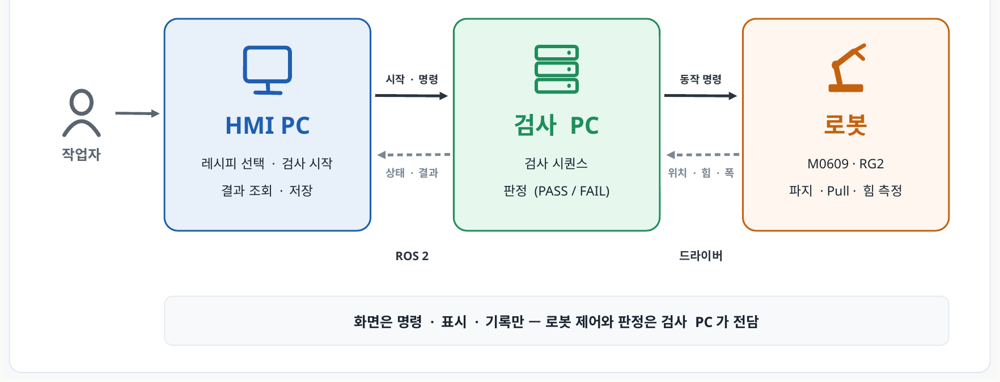
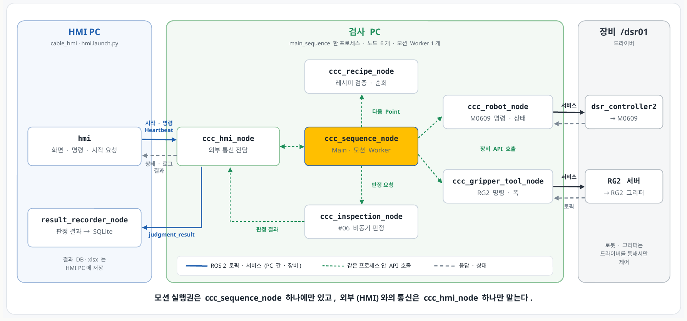
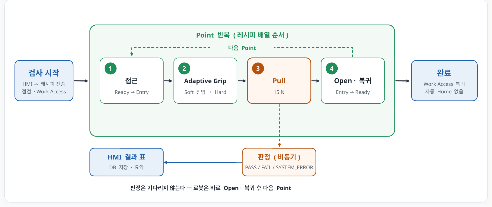

# 케이블 커넥터 체결 검사 자동화 (CCCIS)

> ROS 2 기반 협동로봇(Doosan M0609 + OnRobot RG2) 케이블 · 커넥터 체결 상태 자동 검사 시스템
> D-1조 · 이영훈(팀장, HMI) · 한세교(로봇 동작) · 서진우(중도포기) · 정희진(중도포기) · 멘토 이일주

로봇이 레시피에 등록된 검사 Point로 접근해 케이블을 잡고(Adaptive Grip) 당기면서(Pull), **힘 · 변위 · 그리퍼 폭** 측정값으로 체결 상태를 **PASS / FAIL / SYSTEM_ERROR**로 판정합니다. 작업자는 HMI에서 레시피를 고르고 검사를 시작하며, 결과는 SQLite DB와 엑셀(.xlsx)로 저장됩니다.

| 판정 기준 | 값 |
|---|---|
| Pull 기준 힘 (도달하면 정지) | 15 N |
| 허용 변위 (이하이면 PASS) | 5 mm |
| 파지 실패 (Pull 중 그리퍼 폭) | 16 mm 미만 |
| Pull 최대 거리 (안전 상한) | 25 mm |

---

## 1. 🎨 시스템 설계 및 플로우 차트
프로젝트의 전체적인 구조와 소프트웨어 흐름도입니다.

### 1-1. 시스템 설계도 (System Architecture)
<p align="center">
  
</p>

* *설명: 작업자는 HMI PC에서 레시피 선택 · 검사 시작 · 결과 조회만 하고, 로봇 제어와 판정은 검사 PC가 전담합니다. HMI PC ↔ 검사 PC는 ROS 2(서비스 1 · 토픽 7)로, 검사 PC ↔ 로봇은 두산 · RG2 드라이버로 통신합니다.*

<p align="center">
  
</p>

* *설명: 검사 PC는 `main_sequence` 한 프로세스 안에 노드 6개로 역할을 나눴습니다. 모션 실행권은 `ccc_sequence_node` 하나에만 있고, HMI와의 통신은 `ccc_hmi_node` 하나만 맡습니다.*

| 통신 (`/cable_inspection/…`) | 종류 · 타입 | 방향 | 내용 |
|---|---|---|---|
| `start` | Service · `StartInspection` | HMI → 검사 | 레시피 전체 전송, 접수 여부 · run_id 응답 |
| `command` | Topic · String(JSON) | HMI → 검사 | PAUSE · RESUME · STOP · MOVE_HOME |
| `hmi_heartbeat` | Topic · Empty | HMI → 검사 | 0.5 s마다 생존 신호 (2 s 끊기면 안전 일시정지) |
| `work_status` | Topic · String(JSON) | 검사 → HMI | 진행률 · 현재 단계 · 검사 조건 · Pull 측정값 |
| `robot_status` | Topic · String(JSON) | 검사 → HMI | 좌표 · 힘 · 그리퍼 폭 · 연결 상태 |
| `judgment_result` | Topic · `InspectionResult` | 검사 → HMI | Point별 판정 결과 |
| `log` | Topic · String | 검사 → HMI | 진행 기록 · 오류 |
| `execution_snapshot` | Topic · String(JSON) | 검사 → HMI | 실행 중인 레시피 사본 |

### 1-2. 플로우 차트 (Flow Chart)
<p align="center">
  
</p>

* *설명: HMI가 레시피를 보내면 로봇은 상태를 점검하고 Work Access로 이동합니다. 레시피 순서대로 Point마다 ① 접근(Ready → Entry, MoveJ) ② Adaptive Grip(Soft Grip 상태로 Tool +Z 방향 진입 → Hard Grip) ③ Pull(Tool −Z 방향, 15 N 도달 또는 25 mm) ④ Open · 복귀를 반복합니다. 판정은 비동기로 처리되어 로봇은 판정을 기다리지 않고 다음 Point로 넘어가며, 끝나면 Work Access에서 대기합니다(Home 복귀는 HMI의 Home 이동 명령).*

판정 규칙 (위에서부터 먼저 맞는 조건 적용)

| 순서 | 조건 | 결과 |
|:---:|---|---|
| 1 | 측정값 무효 · 중간 정지(STOPPED_SHORT) · 시간 초과 | SYSTEM_ERROR |
| 2 | Pull 중 최소 그리퍼 폭 < 16 mm | FAIL (파지 실패) |
| 3 | 15 N에 못 미친 채 최대 거리 25 mm 도달 | FAIL (힘 부족) |
| 4 | 힘 정지인데 최대 힘 < 15 N | SYSTEM_ERROR |
| 5 | 15 N 도달 + 변위 ≤ 5 mm | PASS |
| 6 | 15 N 도달 + 변위 > 5 mm | FAIL (변위 초과) |

---

## 2. 💻 운영체제 환경 (OS Environment)
이 프로젝트는 다음 환경에서 개발하였습니다.

* **OS:** Ubuntu 24.04.4 LTS
* **ROS Version:** ROS 2 Jazzy (Fast DDS)
* **Language:** Python 3.12.3 (rclpy 7.1.11)
* **GUI:** PyQt5 5.15.10 / Qt 5.15.13
* **DB:** SQLite 3.45.1
* **IDE:** VS Code

---

## 3. 🛠 사용 장비 목록 (Hardware List)
프로젝트에 사용된 주요 하드웨어 장비입니다.

| 장비명 (Model) | 수량 | 비고 |
|:---:|:---:|:---|
| Doosan Robotics M0609 협동로봇 | 1 | 제어기 IP 192.168.1.100 · 포트 12345 |
| OnRobot RG2 그리퍼 | 1 | Modbus TCP 192.168.1.1 · Tool `ToolWeight`(1.47 kg) · TCP `GripperDA_v1` |
| 검사 PC (Ubuntu 24.04) | 1 | 로봇 · RG2 드라이버 + `cable_inspection` |
| HMI PC (Ubuntu 24.04) | 1 | `cable_hmi` (PyQt5 HMI · 결과 SQLite) |
| 와이어링 하네스 시편 (BMW) | - | 검사 Point `HARNESS_01` ~ `HARNESS_03` |
| RJ45 LAN 케이블 | - | 검사 Point `LAN_L2` · `LAN_L5` · `LAN_MONITOR_ARM_01` |

> PC 1대에서 드라이버 · 검사 노드 · HMI를 모두 실행할 수도 있습니다.

---

## 4. 📦 의존성 (Dependencies)
프로젝트 실행에 필요한 라이브러리입니다. Python 패키지는 [requirements.txt](requirements.txt)에 정리했습니다.

**ROS 2 · 로봇 드라이버**
* ROS 2 Jazzy (`ros-jazzy-desktop`) — rclpy, std_msgs, std_srvs, sensor_msgs, rosidl_runtime_py, ament_index_python, launch, launch_ros
* Doosan Robotics ROS 2 드라이버 (doosan-robot2) — `dsr_msgs2`, `dsr_bringup2`, `dsr_controller2` 2.33.0
* OnRobot RG 드라이버 — `onrobot_rg_msgs`, `onrobot_rg_control` 2.0.0

**Python**
* Python >= 3.12
* PyQt5 5.15.10 — HMI 화면
* openpyxl 3.1.2 — 결과 엑셀 저장 (없으면 CSV로 대신 저장)
* pytest 7.4.4 — 테스트
* sqlite3 — Python 표준 라이브러리

```bash
# Ubuntu 24.04에서는 pip 대신 apt 설치를 권장합니다
sudo apt install python3-pyqt5 python3-openpyxl python3-pytest
# 또는 각 package.xml 기준으로 한 번에 설치
rosdep install --from-paths src --ignore-src -r -y
```

---

## 5. ▶️ 실행 순서 (Usage Guide)
프로젝트를 실행하기 위한 순서입니다. 터미널 명령어를 순서대로 입력해 주세요.

### Step 0. 빌드 (최초 1회)
두산 · RG2 드라이버가 빌드된 워크스페이스(예: `~/ws_cobot_pjt/ws_dsr`)를 먼저 불러온 뒤, 이 폴더의 `src/`를 워크스페이스로 빌드합니다.
```bash
source /opt/ros/jazzy/setup.bash
source ~/ws_cobot_pjt/ws_dsr/install/setup.bash
cd ~/ros_ws        # 이 zip을 푼 폴더 (src/ 아래에 cable_interfaces · cable_inspection · cable_hmi)
colcon build --symlink-install --packages-select cable_interfaces cable_inspection cable_hmi
source install/setup.bash
```
> 새 터미널마다 위의 `source` 3줄을 먼저 실행합니다. PC 2대로 운전할 때는 두 PC의 `ROS_DOMAIN_ID`와 `RMW_IMPLEMENTATION`(`rmw_fastrtps_cpp`)을 같게 맞춥니다.

### Step 1. 로봇 · 그리퍼 드라이버 실행 (검사 PC)
로봇 제어기와 RG2 전원을 켜고, 검사 PC 유선 랜을 로봇 네트워크(192.168.1.x)에 연결한 뒤 실행합니다.
```bash
# 실물 운전에 사용한 bringup (m0609_rg2_bringup)
ros2 launch m0609_rg2_bringup bringup.launch.py mode:=real host:=192.168.1.100 port:=12345 model:=m0609
# 또는 이 저장소에 포함된 launch (dsr_bringup2 + RG2 서버)
ros2 launch cable_inspection robot_bringup.launch.py
```

### Step 2. 검사 노드 실행 (검사 PC)
```bash
ros2 launch cable_inspection inspection.launch.py control_mode:=hmi robot_mode:=real
```
* `main_sequence` 한 프로세스가 시퀀스 · HMI 통신 · 레시피 · 판정 · 로봇 · 그리퍼 노드 6개를 함께 실행하고, HMI의 검사 시작을 기다립니다.
* 실행 기록(측정 샘플 · 판정 · 요약)은 `results/inspection_sequence/`에 남습니다.

### Step 3. HMI 실행 (HMI PC)
```bash
ros2 launch cable_hmi hmi.launch.py mock:=false
```
* `mock:=false` — 실제 검사 노드와 연결합니다. 생략하면 가상 검사 노드가 함께 실행되어 로봇 없이 화면만 시험할 수 있습니다.
* 검사 레시피: `src/cable_inspection/cable_inspection/recipe/inspection/*.json`
* 결과 DB: `~/ros_ws/results/inspection.db` · 결과 파일(.db / .xlsx): `~/ros_ws/results/runs/`

### Step 4. 검사 운전 (HMI 화면)
1. 연결 표시(Robot 연결 · ROS2 통신 · RG2 연결)가 정상인지 확인합니다.
2. Recipe 목록에서 레시피를 고르고 **검사 시작**을 누릅니다.
3. Point마다 접근 → Soft 진입 → Hard Grip → Pull이 진행되고, 오른쪽 게이지에 힘 · 변위 · 그리퍼 폭이 기준선과 함께 표시됩니다.
4. 결과 표에서 Point별 PASS / FAIL을 확인합니다 (행을 누르면 판정 근거 팝업).
5. 끝나면 로봇은 Work Access에서 대기합니다. **Home 이동**으로 복귀하고, **결과 파일 저장**으로 .db / .xlsx를 만듭니다.

> 검사 중 **STOP**(빨간 버튼)은 즉시 정지 후 작업을 종료합니다(자동 Home 없음). **일시정지 / 이어하기**를 지원하며, HMI 통신이 2 s 끊기면 안전 일시정지, 30 s 안에 복구되지 않으면 작업을 종료합니다.

### (선택) 로봇 없이 확인하기
```bash
# ① HMI만: 가상 검사 노드와 함께 실행
ros2 launch cable_hmi hmi.launch.py

# ② 가상 로봇으로 전체 시퀀스: 두산 에뮬레이터 → 검사 노드(가상) → HMI
ros2 launch m0609_rg2_bringup bringup.launch.py mode:=virtual host:=127.0.0.1 port:=12345 model:=m0609
ros2 launch cable_inspection inspection.launch.py control_mode:=hmi robot_mode:=virtual
ros2 launch cable_hmi hmi.launch.py mock:=false

# ③ HMI 없이 터미널로 운전
ros2 launch cable_inspection inspection.launch.py control_mode:=terminal robot_mode:=virtual
ros2 run cable_inspection sequence_console   # 1 START · 2 PAUSE · 3 RESUME · 4 STOP · 5 HOME · 6 레시피 · 7 상태
```
> 가상 모드의 케이블에는 저항이 없어 Pull이 25 mm까지 가므로 판정은 FAIL(최대 거리)로 나옵니다. 시퀀스 순서 확인용입니다.

### (선택) 테스트
```bash
colcon test --packages-select cable_inspection cable_hmi && colcon test-result --verbose
# 검사 파트 재현 · 정량 검증 보고서 (results/checklist/에 저장)
python3 src/cable_inspection/cable_inspection/diagnostics/check_inspection.py
```

---

## 6. 📁 패키지 구성 (Package Structure)
```
src/
├── cable_interfaces/        # HMI ↔ 검사 PC 통신 타입: msg 8 · srv 5 (ament_cmake)
├── cable_inspection/        # 검사 PC: 시퀀스 · 판정 · 로봇 / 그리퍼 제어 (ament_python)
│   ├── launch/              # inspection.launch.py, robot_bringup.launch.py
│   ├── config/              # system_recipe.json (Home · Work Access), tool.json, tcp.json
│   ├── cable_inspection/
│   │   ├── sequence/        # main(작업 순서) · inspection(Point 검사 · 판정) · home_return · common
│   │   ├── hmi/             # HMI 통신 전담 노드
│   │   ├── recipe/          # 레시피 검증 · 순회, inspection/*.json (검사 레시피)
│   │   ├── robot/           # M0609 API
│   │   ├── gripper_tool/    # RG2 API
│   │   ├── safety/          # 작업영역 계산
│   │   └── diagnostics/     # 수동 점검 · 자동 검증 도구
│   └── test/
└── cable_hmi/               # HMI PC: PyQt5 화면 · 결과 DB 저장 (ament_python)
    ├── launch/              # hmi.launch.py, hmi_monitor.launch.py
    ├── cable_hmi/           # main_window(.ui) · ros_bridge · interface · result_db · result_sheet …
    └── test/
```
상세 설계 문서(BRD · 시퀀스 · 검증)는 GitHub 저장소의 `docs/v4/`에 있습니다: https://github.com/tkdak2025/ros_ws

---

## 7. 👥 팀 구성
| 이름 | 파트 | 담당 |
|---|---|---|
| 이영훈 (팀장) | HMI | PyQt5 HMI · 레시피 전송(StartInspection) · 상태 수신 · 결과 DB |
| 한세교 | 로봇 동작 | M0609 · RG2 제어 노드 · 검사 시퀀스 · 판정 · cable_interfaces |
| 서진우 | - | 중도포기 |
| 정희진 | - | 중도포기 |
| 이일주 | 멘토 | 피드백 |
